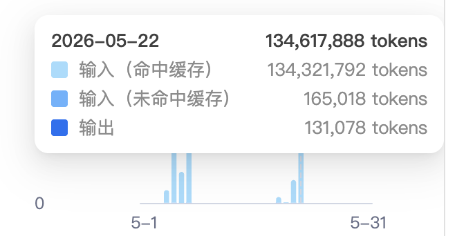
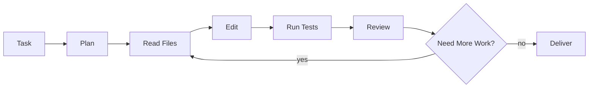
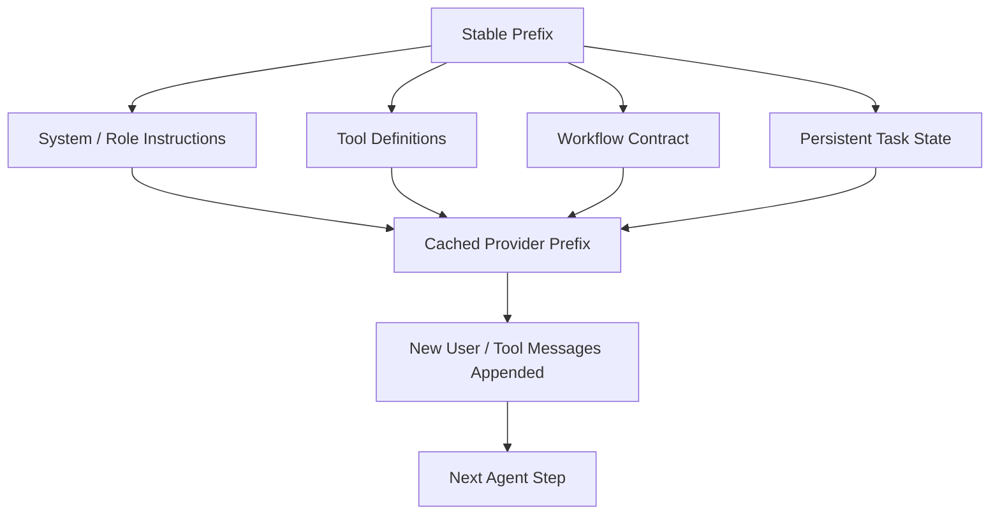

# L0 Technical Note: 99.84%+ Cache Hit Rate in Kevix Coding Harness

## Abstract

Kevix Coding Harness is an ongoing exploration of long-horizon coding-agent workflows.

The first public result is intentionally narrow: under a production-like coding workflow using DeepSeek API, the current Kevix exploration observed a cache hit rate above **99.84%**.

This note explains what that number means, why it matters, how to interpret it, and what it does not prove.

## Result

| Metric | Observed Value |
|---|---:|
| Observed input cache hit rate | **99.88%** |
| Cached input tokens | 134,321,792 |
| Uncached input tokens | 165,018 |
| Output tokens | 131,078 |
| Total tokens shown | 134,617,888 |
| Date shown in capture | 2026-05-22 |
| Context | Long-running coding-agent workflow |
| Provider | DeepSeek API |
| Public release level | L0 technical note |
| Published artifact | Concept, data, interpretation, comparison |
| Not published | Private harness code, private prompts, raw logs, API configuration |



## Calculation

The screenshot separates input tokens into cached and uncached input.

```text
cached input tokens   = 134,321,792
uncached input tokens =     165,018

input cache hit rate
= cached_input / (cached_input + uncached_input)
= 134,321,792 / (134,321,792 + 165,018)
= 99.8773%
≈ 99.88%
```

The headline uses **99.84%+** as a conservative public claim. The captured run itself supports approximately **99.88%** by input-token cache-hit calculation.

## What Cache Hit Rate Means

For long coding-agent sessions, each model call may include:

- system instruction
- tool definitions
- project context
- task state
- previous reasoning or interaction context
- user and tool messages

Provider-side prefix caching can reduce repeated prompt processing when the beginning of the request remains stable.

A high cache hit rate means the workflow is preserving a stable reusable prefix across repeated calls.

## Why This Matters for Coding Agents

Coding agents are not one-shot chatbots. They operate through repeated loops:



Every loop can be expensive if the harness repeatedly sends the same long prefix without cache reuse.

The L0 result suggests that a coding-agent workflow can be shaped to preserve cache efficiency even during long iterative work.

## Interpretation

The 99.84%+ cache hit rate should be interpreted as an infrastructure result, not as a full agent-intelligence result.

It supports this claim:

> Harness structure can materially affect the economics of long coding-agent workflows.

It does not yet prove:

- the agent solves more tasks than other agents
- the harness is better on public coding benchmarks
- the method generalizes to every provider
- the private engine is ready for open-source release

## Conceptual Mechanism

The key design idea is simple:



The harness should avoid unnecessary changes to the early request prefix. New information should be appended or isolated in a way that does not invalidate the reusable prefix.

## Comparison

| Workflow Shape | Cache Behavior | Long-task Cost Profile |
|---|---|---|
| Unstructured chat | Unstable | Repeated context cost can remain high |
| Multi-role workflow with constantly changing prefixes | Fragmented | Different phases may cold-start frequently |
| Stable-prefix coding workflow | High reuse | Lower marginal cost across iterative steps |
| Kevix L0 observed run | 99.84%+; captured run calculates to about 99.88% | Shows high cache reuse is achievable in practice |

## Why This Is Only L0

L0 answers one question:

> Can the coding-agent workflow preserve provider cache efficiency under real long-running usage?

It does not answer the next questions:

- Can the workflow reduce total cost per completed task?
- Can it improve completion rate on real repository tasks?
- Can it outperform comparable workflows on recognized benchmarks?
- Can the method generalize across users, task types, and providers?

## Evidence Boundary

The current public artifact intentionally avoids exposing:

- private source code
- raw task logs
- private prompts
- provider credentials
- unpublished engine implementation

The public claim is limited to the observed cache behavior and the design interpretation.

## Next Step

The next public result should not merely report another cache number. It should connect cache efficiency to agent-workflow outcomes:

- token cost per completed task
- cost difference between stable-prefix and unstable-prefix workflows
- wall-clock latency impact
- number of successful long coding loops under the same budget

That would turn the L0 infrastructure result into a stronger engineering result.
